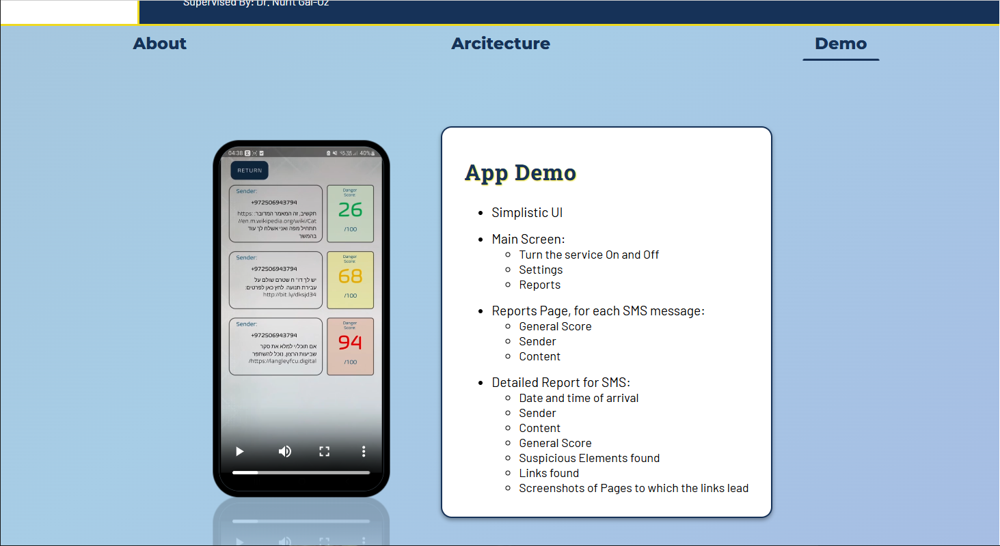
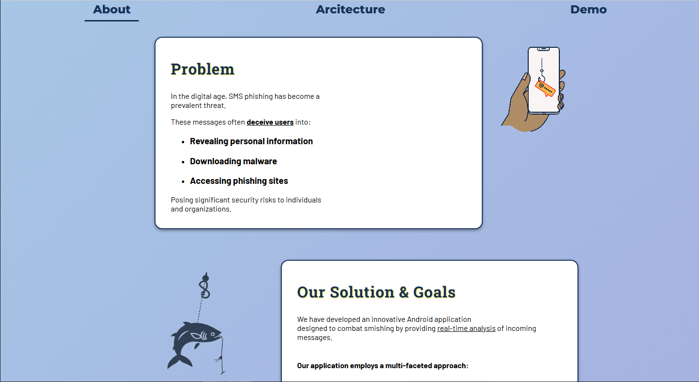
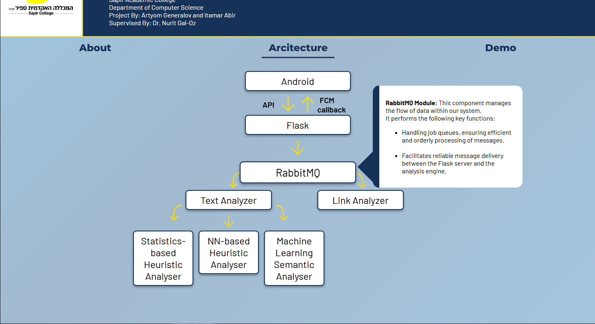

<h1>Mobile App Consept Presentation</h1>

    This mini-project is a Web-Poster designed to showcase an early version of an Android app called &apos;Smishing Buster&apos;.
    The app was developed in an academic setting as part of a CS degree, with the purpose of helping users protect themselves from SMS phishing—also known as &apos;Smishing&apos;.

    The Web-Poster presents the concept, mechanics, and a video demo of the app in a clean and minimalist format.

<h2>Demo</h2>
<a href="https://MirAdam999.github.io/Smishing-Buster/">Live Demo</a>
<h3>OR</h3>
<h4>Avilable on my portfolio website</h4>
<a href="https://resume-omega-pied.vercel.app/projects?project=2">Video Demo</a>

<h2>Screenshots</h2>

